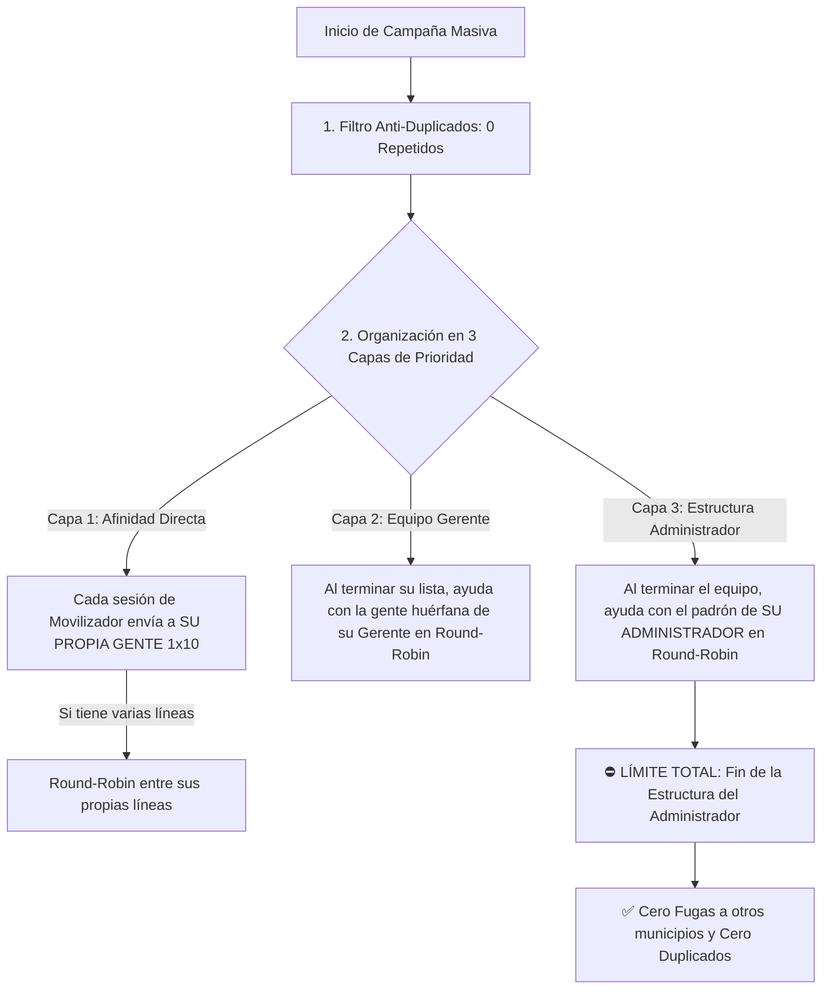

# 🧠 ESTADO DEL SISTEMA, ARQUITECTURA Y CONTEXTO MAESTRO (WhatsApp SaaS & Ecosistema 1x10)

> **Documento de Continuidad Operativa**: Este archivo contiene todo el contexto, credenciales, arquitectura, optimizaciones aplicadas y estado de infraestructura para que cualquier sesión de IA o desarrollador continúe el trabajo de inmediato sin perder información previa.

---

## 🌐 1. Servidor de Producción AWS EC2 (Nodo Maestro Actual)

| Parámetro | Valor / Configuración |
| :--- | :--- |
| **IP Pública** | `52.202.57.2` |
| **Dominio con SSL** | `https://principal.liberales26.com/` |
| **Sistema Operativo** | Ubuntu 24.04 LTS (HVM), SSD Volume Type |
| **Usuario SSH** | `ubuntu` |
| **Ruta Llave SSH Local** | `D:\Users\fmadrid\Downloads\paraguay.pem` |
| **Comando de Conexión** | `ssh -i D:\Users\fmadrid\Downloads\paraguay.pem ubuntu@52.202.57.2` |
| **Ruta del Proyecto en Servidor**| `/var/www/whatsappmanager` |
| **Panel Web SaaS (Login)** | `admin@demo.local` / `Admin2026!` |
| **API Key de Integración** | `clave-secreta-integracion-1x10` |

---

## 🗄️ 2. Base de Datos Central y Redis

### SQL Server Central
- **Host / Puerto**: `db.contactmanager.net,1433`
- **Usuario**: `ti`
- **Contraseña**: `selectov2`
- **Base de Datos WhatsApp SaaS**: `whatsapp_saas` (Prisma ORM)
- **Base de Datos Campaña / Encuestas**: `AppCampana1x10` (.NET Core 8)
- **Persistencia de Sesiones**: Toda la autenticación de Baileys (`creds.json`, tokens, llaves criptográficas) se almacena cifrada en SQL Server (`BaileysCredential`, `BaileysAuthKey`). **Si se apaga o reinicia el servidor, NUNCA se pierden las sesiones de WhatsApp**.
- **Cadena de Conexión Optimizada**:
  ```env
  DATABASE_URL="sqlserver://db.contactmanager.net:1433;database=whatsapp_saas;user=ti;password=selectov2;encrypt=true;trustServerCertificate=true;schema=dbo;connection_limit=10;pool_timeout=60"
  ```
  *(Límite de 10 conexiones por worker para permitir hasta 60 servidores sin saturar los worker threads de SQL Server).*

### Redis Local (En cada nodo)
- **Host**: `127.0.0.1:6379` (0 ms de latencia)
- **Modo**: `COORDINATION_PROVIDER=REDIS`
- **Key Prefix**: `waas`
- **Buffer de Encolado**: BullMQ almacena los trabajos en memoria ultra-rápida. Si SQL Server tiene micro-cortes, Redis conserva los datos sin limpiarlos hasta que se asiente la sincronización.

---

## ⚙️ 3. Servicios PM2 y Configuración en Servidor

En cada servidor corren 3 procesos administrados por PM2:
1. **`whatsapp-api`** (Puerto `3000`): API REST y WebSockets para Baileys y panel web.
2. **`whatsapp-worker`** (Puerto Métricas `9464`): Worker supervisor de sesiones, colas y despachos masivos.
3. **`pm2-logrotate`**: Módulo activo de rotación automática de logs:
   - `max_size`: `50M`
   - `retain`: `7` archivos
   - `compress`: `true` (compresión gzip)
   - `rotateInterval`: `0 0 * * *` (diario a medianoche)

### Archivo `ecosystem.config.cjs`:
```javascript
module.exports = {
  apps: [
    {
      name: 'whatsapp-api',
      script: './backend/dist/api/main.js',
      cwd: '/var/www/whatsappmanager',
      node_args: '--env-file=/var/www/whatsappmanager/.env',
      instances: 1,
      autorestart: true,
      watch: false,
      max_memory_restart: '1500M',
      env: { PORT: 3000 },
    },
    {
      name: 'whatsapp-worker',
      script: './backend/dist/worker/main.js',
      cwd: '/var/www/whatsappmanager',
      node_args: '--env-file=/var/www/whatsappmanager/.env',
      instances: 1,
      autorestart: true,
      watch: false,
      max_memory_restart: '1500M',
    },
  ],
};
```

---

## 🚀 4. Algoritmo de Envíos Masivos: Cascada Jerárquica + Round-Robin

El sistema implementa el modelo de **Afinidad Directa + Round-Robin Colaborativo de Colas**:



### Reglas Clave:
1. **Fase 1 (Afinidad Propia)**: Si la sesión `u3073_linea1` y `u3073_linea2` pertenecen al movilizador Juan, sus contactos propios se reparten en **Round-Robin exclusivo entre sus 2 números**.
2. **Fase 2 (Colaboración en Equipo)**: Apenas Juan termina sus contactos, sus números pasan a la cola compartida del Gerente de su zona y despachan los contactos de movilizadores sin WhatsApp conectado (haciendo Round-Robin entre todas las líneas libres).
3. **Fase 3 (Colaboración Global del Administrador)**: Si se termina la zona, todas las líneas libres colaboran en Round-Robin con el padrón de ese Administrador.
4. **Blindaje de Aislamiento Territorial**: Mediante un CTE recursivo `ArbolTerritoriosAdmin` en SQL Server, **los envíos jamás se fugan a la estructura de otro Administrador/Municipio**.
5. **Cero Duplicados**: Deduplicación estricta por celular en memoria (`HashSet<string>` y `Set<String>`).
6. **Anti-Baneo con Pacing Humano (Jitter)**: Delays orgánicos aleatorios entre `1000ms` y `2200ms` por mensaje.

---

## 📍 5. Identificación de Municipio y Zona en Flutter y .NET Core

- **Resolución Automática**: [`territorio_helper.dart`](file:///d:/proyectos/git/1x10futter/lib/core/utils/territorio_helper.dart) explora la jerarquía territorial del usuario (`ZONA` ➔ `MUNICIPIO` ➔ `DEPARTAMENTO`).
- **Respuesta de Login .NET Core**: [`AuthService.cs`](file:///d:/proyectos/git/1x10apinetcore/Application/Auth/AuthService.cs) retorna `Municipio` y `Zona` en el payload de autenticación.
- **Mensaje de Bienvenida**: [`login_page.dart`](file:///d:/proyectos/git/1x10futter/lib/presentacion/auth/login_page.dart) muestra:
  `¡Bienvenido, [Nombre]! 📍 Municipio: [Municipio] • 📌 Zona: [Zona]`
- **Insignias en Encabezados**: [`page_header_card.dart`](file:///d:/proyectos/git/1x10futter/lib/presentacion/widgets/page_header_card.dart) renderiza chips interactivos de ubicación en todas las pantallas principales de rol (`AdminGestionPage`, `GerenteGestionPage`, `MovilizadorGestionPage`, `HomePage`).

---

## ⚡ 6. Optimizaciones Críticas de Rendimiento Aplicadas

1. **Persistencia Paralela de Claves Auth de Baileys**:
   - Se reemplazó el bucle secuencial `for (...) await setKey(...)` por `await Promise.all(tasks)` en `baileys-auth-state.factory.ts`, reduciendo el guardado de claves de 6.000 ms a **80 ms**.
2. **Caché en Memoria de Versión de Baileys**:
   - `getCachedBaileysVersion()` en `baileys-session-gateway.ts` elimina peticiones externas a GitHub al iniciar sockets.
3. **Protección de Leases durante Negociación QR**:
   - `renewLease` y `/session/:id/start` no limpian `leaseOwner` de workers activos mientras el usuario escanea el QR.
4. **Intervalo del Supervisor**:
   - `SESSION_SUPERVISOR_INTERVAL_MS=1500` para detección y arranque inmediato de sesiones.
5. **Desacoplamiento de Estadísticas de Campaña**:
   - Actualización atómica incremental (`incrementSent` / `incrementFailed`) y consolidación con *Debounce* cada 6 segundos.
6. **Compresión GZIP en Nginx**:
   - Nginx configurado con compresión nivel 6 para carga instantánea del frontend.

---

## 📱 7. Integración con la App Móvil Flutter (`1x10futter`)

El archivo [`whatsapp_service.dart`](file:///d:/proyectos/git/1x10futter/lib/data/services/whatsapp_service.dart) en Flutter se comunica de forma nativa con los siguientes endpoints:

| Acción en Flutter | Método | Endpoint Backend |
| :--- | :--- | :--- |
| **Detectar IP Pública** | `GET` | `/system/public-ip` |
| **Listar Sesiones de Usuario** | `GET` | `/sessions?userId={id}&username={user}&role={rol}` |
| **Obtener Estado de Sesión** | `GET` | `/session/{sessionId}/status` |
| **Obtener Código QR** | `GET` | `/session/{sessionId}/qr` *(devuelve QR en Base64)* |
| **Vincular por Código Numérico** | `POST` | `/session/{sessionId}/pairing-code` |
| **Enviar Difusión Masiva** | `POST` | `/session/{sessionId}/send` `{"to": "...", "message": "..."}` |
| **Crear Campaña Masiva** | `POST` | `/campaigns` |

---

## 🛠️ 8. Comandos de Gestión y Mantenimiento

### Actualizar el servidor en 1 línea:
```bash
ssh -i D:\Users\fmadrid\Downloads\paraguay.pem ubuntu@52.202.57.2 "/var/www/whatsappmanager/actualizar.sh"
```

### Ver logs en tiempo real:
```bash
ssh -i D:\Users\fmadrid\Downloads\paraguay.pem ubuntu@52.202.57.2 "pm2 logs"
```

### Verificar salud del servidor:
```bash
curl https://principal.liberales26.com/health/ready
# Respuesta esperada: {"status":"ready","checks":{"database":"ok","s3":"ok"},"version":"1.3.0-alpha"}
```

---

## 📁 9. Estructura de Proyectos en el Espacio de Trabajo Local

- `d:\proyectos\git\whatsappmanager`: Backend (Node.js/Prisma/Baileys) y Frontend (Angular 19/PrimeNG).
- `d:\proyectos\git\1x10futter`: Aplicación móvil en Flutter con módulo de difusión y vinculación QR.
- `d:\proyectos\git\1x10apinetcore`: API Backend en .NET Core 8 con validación de roles y estructura jerárquica.
- `d:\proyectos\git\encuesta2`: Sistema web de encuestas electorales.
- `d:\proyectos\git\GUIA_INSTALACION_SERVIDOR_AWS.md`: Guía paso a paso para duplicar servidores en nuevas IPs.
- `d:\proyectos\git\ESTADO_DEL_SISTEMA_Y_CONTEXTO.md`: Este archivo maestro de contexto.
